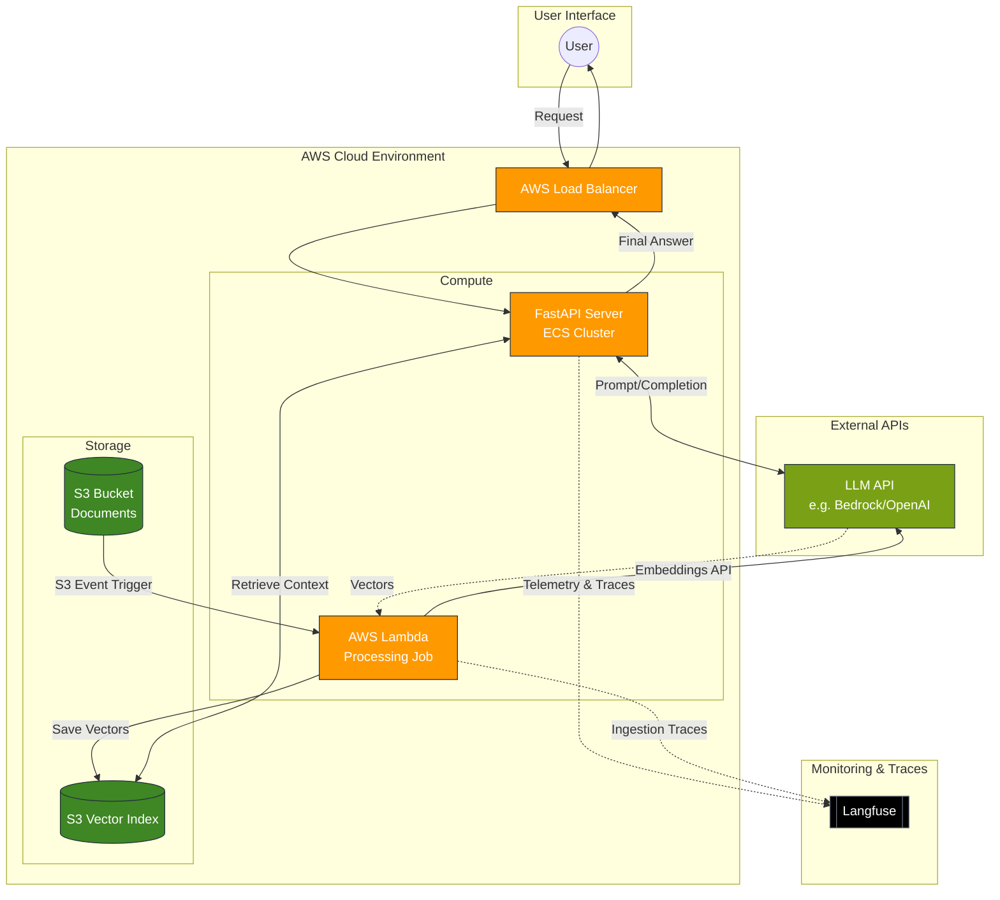

# Nzambe RAG

Nzambe is a Retrieval-Augmented Generation (RAG) application designed to provide accurate, context-aware answers to queries based on the primary holy books: the Bible, Quran, and Torah.

## Architecture

The following diagram illustrates the flow from a user query to the final response within the AWS-hosted infrastructure.



## Design Tradeoffs

Building a RAG application involving large sacred texts involves several critical tradeoffs:

- **Local vs. Cloud LLMs**: We use Ollama for local development to minimize costs during development, while the production environment is structured to interface with robust LLM APIs to handle the complexity of theological interpretation.

- **Vector Storage**: Instead of a dedicated vector database service (like Pinecone), we store indices in Amazon S3. This significantly reduces infrastructure costs for a low-traffic application while maintaining sufficient retrieval speed for our current document scale.

- **Accuracy vs. Latency**: The current implementation prioritizes simple retrieval. While adding reranking and BM25 hybrid search (planned) increases latency, it is necessary to handle the linguistic nuances found in ancient texts.

## Getting Started

### 1. Clone the Repository

```bash
git clone https://github.com/aywandji/nzambe.git
cd nzambe
```

### 2. Local Setup

**Download Data**: For the Bible in English, you can use:

```bash
curl https://www.gutenberg.org/cache/epub/10/pg10.txt --output .debug/data/bible_en.txt
```

**Configuration**: The baseline configuration is defined at `config/base.yaml`. Update it according to your preferences. The expected values are defined in pydantic settings `nzambe.config.NzambeSettings`. If you want to have a special config for your staging/prod envs, you must update the corresponding files. Also if you want a special config for your local development, you must create and update a `local.yaml` file.

**Environment Variables**: Create a `.env` file to add the environment variables that will be used during local development. You can follow the `example.env` structure. This file will be read while launching the RAG server.

**Third-Party Services**:

- **Langfuse**: Self-host Langfuse for observability. Add your keys to a `.env` file.
- **Ollama**: Install Ollama for local model serving.
- **OpenAI**: You can also use OpenAI models. You just have to update your config files (`local.yaml` and/or `base.yaml`) accordingly.

### 3. Deployment (AWS)

This project uses Terraform for Infrastructure as Code and GitHub Actions for CI/CD.

**Manual Deployment**: Navigate to the `/terraform` directory and follow the README file within that directory.

**CI/CD**: Pushing to the main branch triggers the GitHub Action workflow which:

1. Builds the Docker image.
2. Pushes the image to Amazon ECR.
3. Updates the ECS Service to deploy the new task definition.

## Usage

### Setup Environment and Install
Before querying, ensure your environment is set up and the package is installed. We recommend using [uv](https://github.com/astral-sh/uv) for fast, reliable dependency management.
```bash
# Create a virtual environment and install the package in editable mode
uv venv
source .venv/bin/activate  # On Windows: .venv\Scripts\activate
uv pip install -e .
```
### Launch the Local Server
For the local deployment, launch the FastAPI server with hot-reloading:

```bash
nzambe server --reload
```

### Querying the API

You can query the deployed app or local instance using the `nzambe` CLI:

**Via CLI**:

To query the local server:

```bash
nzambe query -q "Give me in order what was created at the beginning"
```

To query the remote server:

```bash
nzambe query -q "What happen to Jonah in one sentence?" --base-url <ALB_DNS_NAME>
```

**Note**: `<ALB_DNS_NAME>` can be retrieved from your Terraform outputs.

## Evaluation Framework

Nzambe includes a comprehensive evaluation framework to measure and improve RAG performance. The framework uses synthetic data generation and LLM-as-judge approaches to evaluate both retrieval quality and answer generation.

### Components

#### 1. Synthetic Question Generation

The framework generates evaluation questions from document chunks using high-end LLMs, ensuring questions test the retrieval system's ability to find relevant contexts.

**Key Features:**
- Uses a powerful model to generate contextually relevant questions from document nodes
- Prevents duplicate generation by tracking existing questions per node
- Customizable prompt template (configured in `config/base.yaml`)
- Incremental dataset updates to avoid regenerating questions

**Usage:**

```python
from nzambe.helpers.eval import generate_new_questions_from_index

# Generate new questions from your vector index
qa_dataset = generate_new_questions_from_index(
    ollama_model_name="qwen2.5:14b",           # High-quality model for generation
    index_storage_dir=".debug/storage",         # Path to your vector index
    num_questions_per_node=2,                   # Questions per document chunk
    num_nodes_to_sample=50,                     # Number of chunks to sample
    random_seed=42,                             # For reproducibility
    questions_dataset_path=".debug/qa_dataset.json"  # Save/update dataset
)
```

The generated dataset follows LlamaIndex's `EmbeddingQAFinetuneDataset` format and can be used for:
- Embedding model evaluation and fine-tuning
- Retrieval system benchmarking
- Regression testing after system changes

#### 2. Retrieval Quality Evaluation

The evaluation framework assesses how well your chosen embedding model retrieves relevant contexts for generated questions. This helps you:
- Select the optimal embedding model for your domain (sacred texts)
- Tune retrieval parameters (similarity threshold, top-k)
- Compare different retrieval strategies

#### 3. LLM-as-Judge Metrics

The framework uses LLMs to evaluate production traces from Langfuse, providing continuous quality monitoring.

**Implemented Metrics:**

- **Answer Relevancy**: Evaluates how well the generated answer addresses the user's query. Measures query/answer alignment without requiring ground truth.

- **Faithfulness**: Measures whether the answer is grounded in the retrieved contexts. Detects hallucinations by checking if claims in the answer can be traced to the provided context.

**Usage:**

```python
from nzambe.helpers.eval import run_nightly_benchmark

# Evaluate recent production traces
run_nightly_benchmark(
    last_n_hours=24,        # Evaluation time window
    num_traces_limit=100    # Number of traces to evaluate
)
```

This function:
1. Fetches traces from Langfuse (with input queries, retrieved contexts, and generated answers)
2. Runs evaluation using RAGAS metrics with your configured LLM
3. Pushes scores back to Langfuse for dashboard visualization
4. Enables tracking quality trends over time

**Configuration:**

Evaluation settings are defined in your config files under the `eval` section:

```yaml
eval:
  ollama_model: "qwen2.5:14b"
  ollama_base_url: "http://localhost:11434"
  embedding_model:
    platform: "ollama"
    name: "nomic-embed-text"
  qa_generate_prompt: |
    {{default_qa_generate_prompt}} Make sure the question(s) don't give a clue about the context...
```
### Implementation Files

- Core evaluation logic: `src/nzambe/helpers/eval.py`
- Test suite: `tests/helpers/test_eval.py`
- Configuration: `config/base.yaml` (eval section)

## Next Steps

- [ ] **Data Expansion**: Incorporate the Quran and Torah into the vector index.
- [ ] **Retrieval Optimization**: Implement Reranking and BM25 hybrid search. Also include a SummaryIndex to improve robustness on queries spanning multiple books.
- [ ] **Node Filtering**: Add metadata filtering to allow users to query specific books.
- [ ] **Observability**: Deploy Langfuse in the cluster to track every interaction and ease RAG app evaluation.
- [ ] **Evaluation**:  Make the evaluation process production-ready through automation
